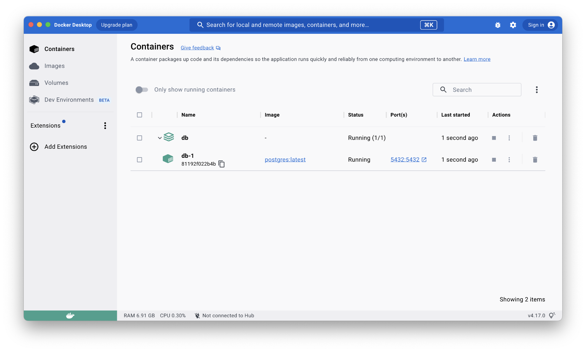
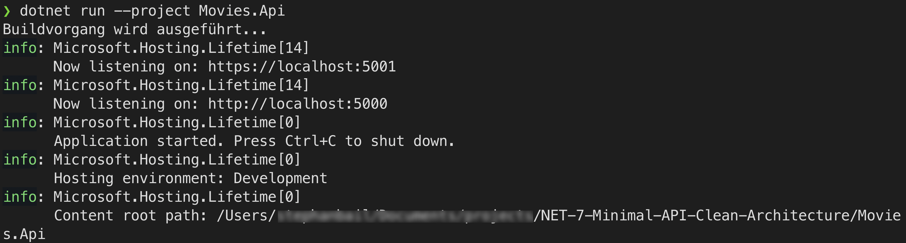

# Movie and Rating API

A feature-rich and robust RESTful API for managing movies and their ratings, built using ASP.NET Core, C#, PostgreSQL, and Dapper ORM. The API includes advanced features like pagination, sorting, and validation, as well as dependency injection and separation of concerns. This project is inspired by Nick Chapsas' course, ["From Zero to Hero: REST APIs in .NET"](https://nickchapsas.com/courses/enrolled/2022064).

## Acknowledgments

A special thanks to **Nick Chapsas** for his excellent course on building REST APIs in .NET. Nick is a Microsoft MVP for Developer Technologies with years of experience in Software Engineering and Engineering Management. He has worked for some of the world's largest companies, building systems that serve millions of users and tens of thousands of requests per second. Nick is also a YouTube content creator, producing free educational content for C# and .NET. Check out his course [here](https://nickchapsas.com/courses/enrolled/2022064).

## About the Author


**Stephan Bail** is a passionate Microsoft Azure architect & consultant with extensive experience working with blue-chip organizations. Based in Munich, Germany, Stephan enjoys advising mid-sized to large businesses and leveraging his expertise to ensure their cloud journey is successful.

- Personal Website: [stephanbail.com](https://stephanbail.com)
- GitHub: [github.com/stephanbail](https://github.com/stephanbail)

## Features

- Create, read, update, and delete (CRUD) operations for movies
- Rate a movie for a specific user
- Retrieve movie ratings for a user
- Pagination and sorting for movie listings
- Validation for incoming requests to ensure data integrity
- Dependency injection for extensibility and maintainability
- Separation of concerns to facilitate easier code management and testing

## Getting Started

These instructions will get you a copy of the project up and running on your local machine for development and testing purposes.

### Prerequisites

- .NET 7.0 SDK or later: Download from [here](https://dotnet.microsoft.com/en-us/download/dotnet/7.0)
- PostgreSQL: Setup via Docker Desktop and docker-compose using the compose file included in the project

#### Setting up PostgreSQL using Docker

1. Install [Docker Desktop](https://www.docker.com/products/docker-desktop) if you don't have it already.

2. Navigate to the `Movies.Application` directory:

```
cd Movies.Application
```

3. Use the included `docker-compose.yml` file to set up PostgreSQL:

Path: `Movies.Application/docker-compose.yml`

```yaml
version: '3.9'

services:

  db:
    image: postgres:latest
    restart: always
    environment:
      - POSTGRES_USER=pguser
      - POSTGRES_PASSWORD=changeme
      - POSTGRES_DB=movies
    ports:
      - '5432:5432'
```

4. Run the following command to start the PostgreSQL container:

```
docker-compose up -d
```




This will set up a PostgreSQL instance with the required configuration. Make sure to adjust the connection string in `appsettings.json` accordingly.

### Installation

1. Clone the repository:

```
git clone https://github.com/stephanbail/.NET-7-Minimal-API-Clean-Architecture.git
```

2. Change to the project directory:

```
cd .NET-7-Minimal-API-Clean-Architecture
```

3. Set up the PostgreSQL database and adjust the connection string in `appsettings.json` accordingly.

4. Run the following command to restore the required packages:

```
dotnet restore
```

5. Run the following command to build the project:

```
dotnet build
```

6. Run the following command to start the API:

```
dotnet run --project Movies.Api
```



7. Open your browser or preferred API testing tool (e.g., Postman) and navigate to the API endpoints.

## Usage

The API exposes the following endpoints:

- `GET /api/movies` - Get all movies (paginated)
- `GET /api/movies/{id}` - Get a movie by ID
- `POST /api/movies` - Create a new movie
- `PUT /api/movies/{id}` - Update a movie
- `DELETE /api/movies/{id}` - Delete a movie
- `POST /api/movies/{id}/rating` - Rate a movie
- `GET /api/users/{userId}/ratings` - Get movie ratings for a user

Refer to the API documentation for detailed information on request and response formats.

## Contributing

Contributions are welcome! Feel free to submit pull requests or open issues to help improve the project.

## License

This project is licensed under the MIT License.

## Contact

If you have any questions or suggestions, feel free to reach out to Stephan Bail via [stephanbail.com](https://stephanbail.com) or on [GitHub](https://github.com/stephanbail).